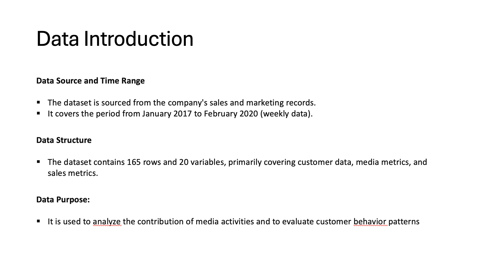

# Subscription Service 'Recipe Box' Task
**Task Introduction:**

Your client has a subscription service that supplies recipes and associated ingredients, direct to consumers via their website. Please take at ***maximum 3 hours*** to interrogate the dataset and paint a picture of their business. It has ***3 questions below*** to provide guidance on how to tackle the task. Please have any workings in ***Excel*** ready to show (***PowerPoint*** may be used).

The dataset(Excel) can be found in the [Subscription_Task(3hours).xlsx](https://github.com/atomxu10/MediaDataAnalysis/blob/main/Subscription_Task(3hours).xlsx)

**Questions:**

1. Chart the clients' New and Existing Customer data.
  Please make it clear what the changes over time are, what are the patterns in the data, is the client in growth or decline?
  Are there key factors that may influence new & existing customer growth? Explore further charting to explain what the relationship between the   factor and client data is.

2. We have included both spend and TV ratings for 3 major campaigns. Describe the relationship between the TV Campaign and the customer data.
Can you make an educated guess about which campaign (A, B, C) was the most effective at driving customer growth?
Explain what other benefits the client could get from their TV advertising.

3. The client wants you to answer the question "How is media contributing to my business growth?
Using the existing data, how would you help the client answer this?
What other data sources would you request and why?

I completed the data processing task (data cleaning, analysis, visualization, and modeling) in Excel within two hours. Additionally, I spent one-hour creating presentation slides using PowerPoint.

**Content:**

    

