# Subscription Service 'Recipe Box' Task
**Task Introduction:**

Your client has a subscription service that supplies recipes and associated ingredients, direct to consumers via their website. Please take at ***maximum 3 hours*** to interrogate the dataset and paint a picture of their business. It has ***3 questions below*** to provide guidance on how to tackle the task. Please have any workings in ***Excel*** ready to show (***PowerPoint*** may be used).

The dataset(Excel) can be found in the [Subscription_Task(3hours).xlsx](https://github.com/atomxu10/MediaDataAnalysis/blob/main/Subscription_Task(3hours).xlsx)

**Questions:**

1. Chart the clients' New and Existing Customer data.
  Please make it clear what the changes over time are, what are the patterns in the data, is the client in growth or decline?
  Are there key factors that may influence new & existing customer growth? Explore further charting to explain what the relationship between the   factor and client data is.

2. We have included both spend and TV ratings for 3 major campaigns. Describe the relationship between the TV Campaign and the customer data.
Can you make an educated guess about which campaign (A, B, C) was the most effective at driving customer growth?
Explain what other benefits the client could get from their TV advertising.

3. The client wants you to answer the question "How is media contributing to my business growth?
Using the existing data, how would you help the client answer this?
What other data sources would you request and why?

I completed the ***data processing task (data cleaning, analysis, visualization, and modeling)*** in **Excel** within 2 hours. Additionally, I spent 1 hour creating presentation slides using **PowerPoint**.

**Content (Powerpoint):**

    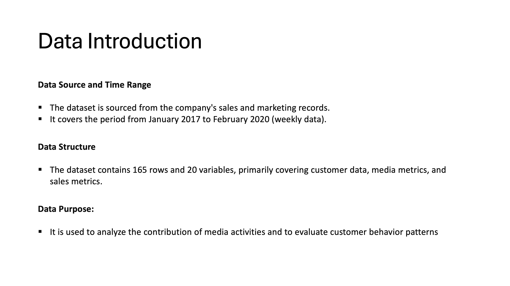

Let's first examine the time series data for new and existing customers. The blue line represents the total revenue for each week over three years. To clarify the trend, I applied the Moving Average method, which is illustrated by the red line. Despite some fluctuations, we can observe a consistent upward trend over time. Significant fluctuations are marked with green circles for low points and red circles for high points. Comparing the different charts, it is evident that these fluctuations occurred at similar times for both new and existing customers. This pattern suggests that the fluctuations might have been influenced by certain campaigns, which will be discussed in more detail later.

    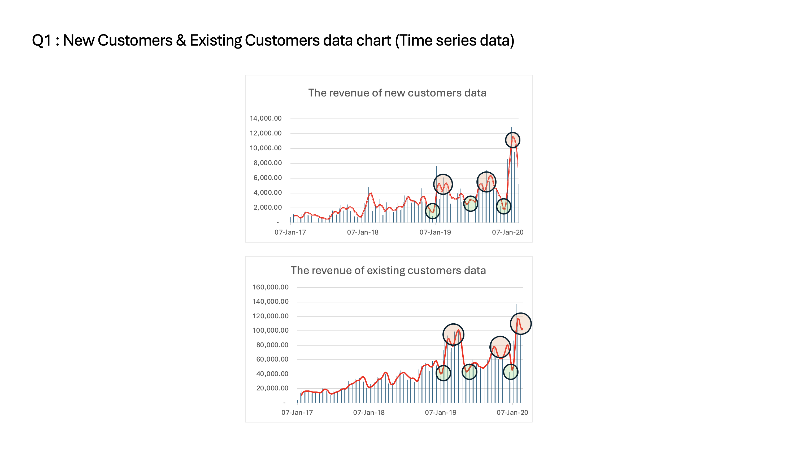

To determine whether the client was in growth or decline, I divided the nearly three years of data into three segments, each covering 55 weeks. The bar charts on the right illustrate the total revenue from different customer segments, both showing significant increases. Based on this analysis, we can conclude that the client is in a period of growth.

    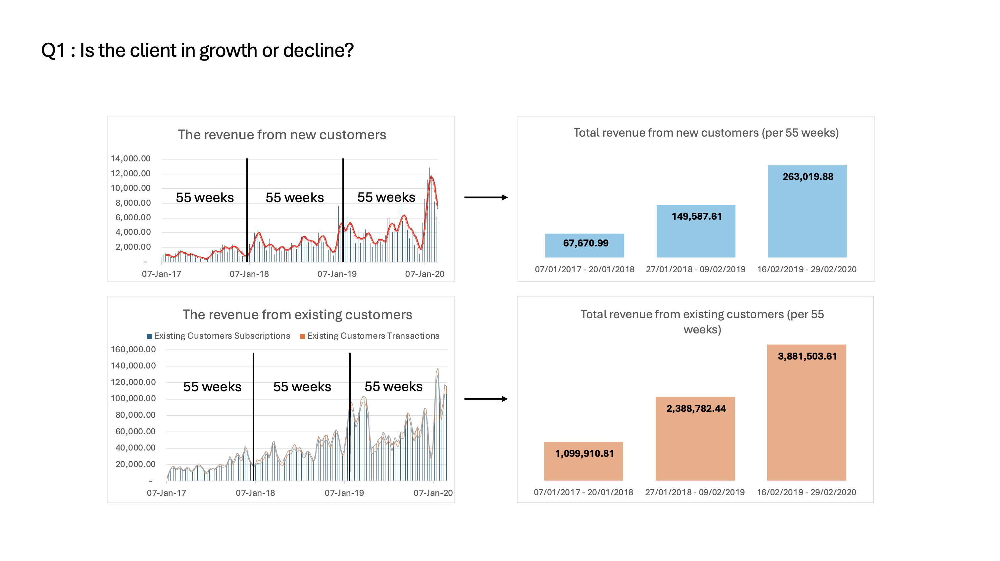

To identify the key factors influencing the growth of new and existing customers, I conducted a correlation analysis to assess the strength of associations between variables. Based on the correlation coefficients, we can conclude that PPC brand impressions, paid social impressions, and TV campaigns have the most significant influence on the growth of new customers. For existing customers, paid social impressions, brand awareness, and market share are the most significant influencing factors.

    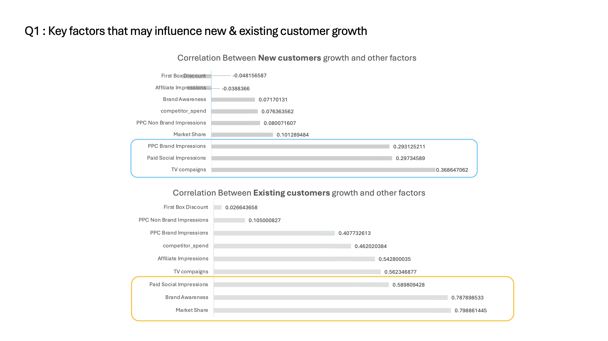

The line chart illustrates the changes in total customer revenue over time. The orange line indicates the revenue data during each TV campaign period, showing a significant increase. In the table below, I have calculated the average revenue increase per week during each TV campaign period compared to normal periods.

    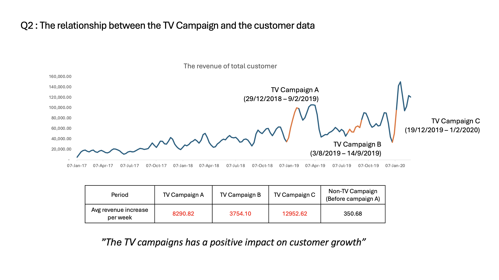

The new customers transfer existing customers need one month. Therefore, I included 4 weeks data after the campaign in consideration. And I calculated the average customer growth in each campaign. Combined with total revenue (even if Campaign C was the highest) and ROI calculation, Campaign A had the highest ROI so I will conclude that Campaign A was the most cost-effective at driving customer growth.

    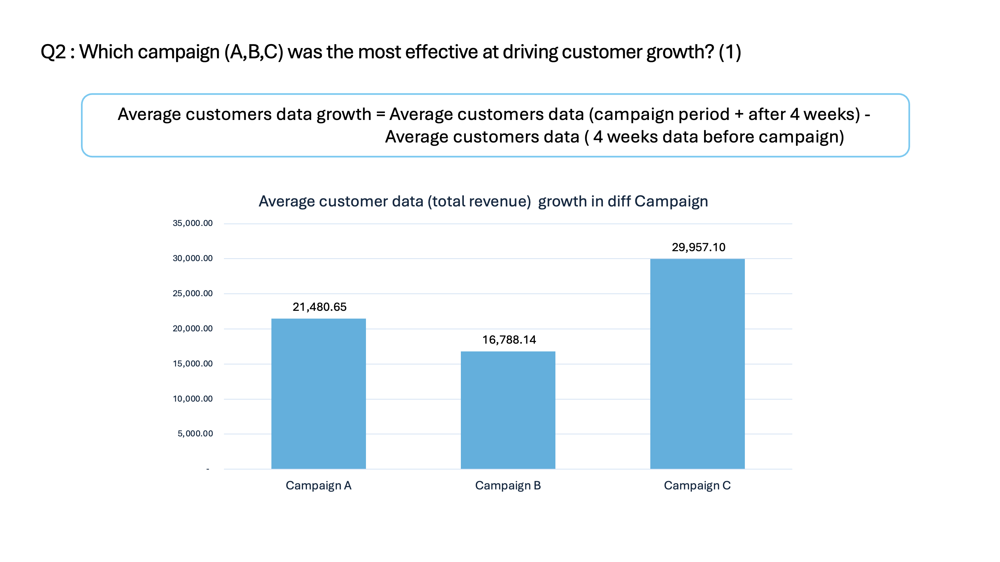

    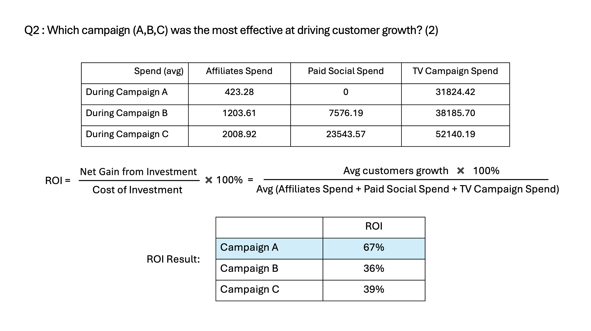

In the meanwhile, As shown in the line chart, during TV campaign periods, both market share and brand awareness increased significantly.

    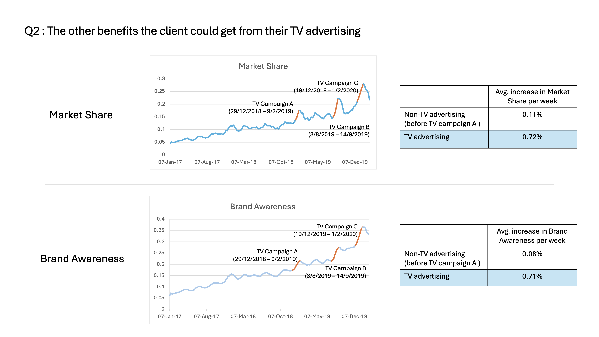

To answer the question: "How is media contributing to business growth?" my opinion is to identify an aspect influenced by media. My first thought is customer behavior. In the existing dataset, Brand Awareness is a relevant feature. Then, I would like to explore how customer behavior affects business growth. 

    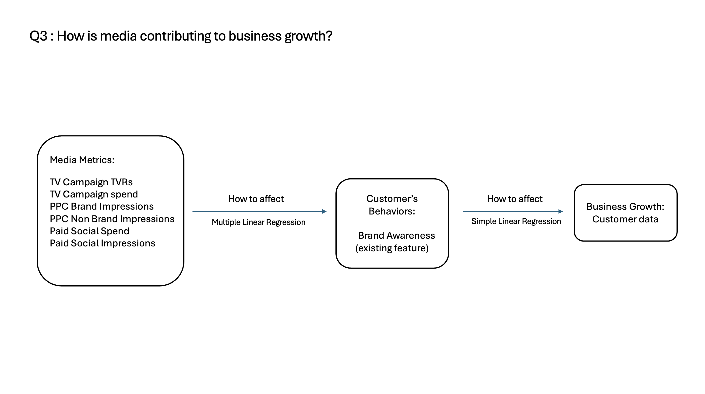

I used a multiple linear regression model to explore the relationship between media metrics and brand awareness. From the results, we can see that the p-value of some variables, such as TV Campaign Spend and Paid Social Impressions, suggests a strong positive impact on brand awareness. The model's R-squared value indicates that approximately 52.88% of the variance in brand awareness can be explained by these media metrics.

    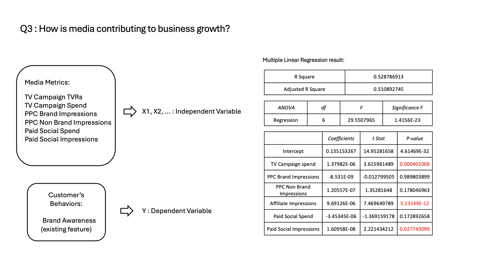

I used a simple linear regression model to explore the relationship between brand awareness and business growth. The results show an R-squared value of 0.704, indicating that 70% of the variation in business growth can be explained by changes in brand awareness. This suggests a strong positive correlation, reinforcing the conclusion that media contributes to business growth by increasing brand awareness.

    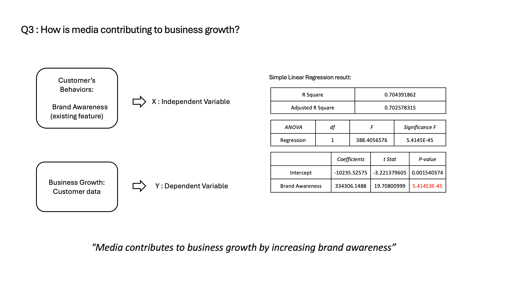

To further analyze customer growth, I would request the following data sources:

-  User’s Behaviors Data, Website Data (Page views, unique visitors, conversion rate, time spent on site), Social Media Engagement (Likes, shares, comments)

User’s Behaviors Data can show the impact of media campaigns on website visits and user behavior helps to Understand the effectiveness of social media activities.

Customer Acquisition Cost helps evaluate the efficiency of different media channels

Economic and Industry Data determine market demand and set reasonable expectations. it also help evaluate the market environment and adjust strategies
